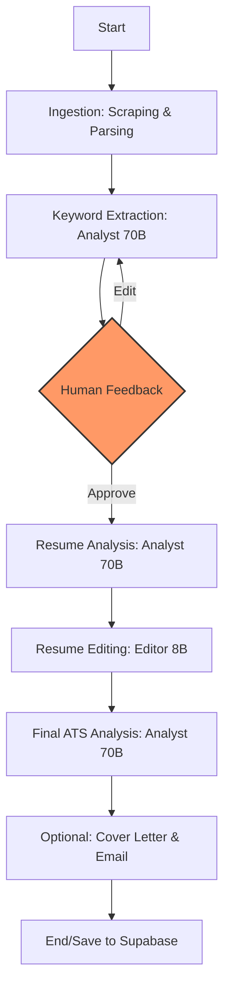

# ResMe 2.0 — Production-Grade Multi-Agent AI Platform

**ResMe 2.0** is an AI-powered resume optimization platform designed to beat Applicant Tracking Systems (ATS). Built with a stateful multi-agent architecture using **LangGraph**, it provides a robust, production-ready solution that combines LLM reasoning with high-reliability infrastructure.

---

## 🚀 Key Features

- **Multi-Agent Workflows**: Orchestrated by LangGraph to handle keyword extraction, ATS analysis, and resume editing as distinct, intelligent steps.
- **Human-in-the-Loop (HITL)**: Intermediate feedback stages allow users to review AI-extracted keywords before the optimization begins.
- **Stateful Persistence**: Uses Upstash Redis for workflow checkpointing—if a process crashes, it resumes exactly where it left off.
- **Supabase Integration**: Direct integration with Supabase for user authentication (JWT/OAuth) and long-term resume history storage.
- **ATS Intelligence**: Proprietary scoring algorithm that analyzes job descriptions and ensures 90%+ keyword alignment without fabrication.
- **Cost-Optimized LLMs**: Dual-model strategy using Groq's Llama 3.3 (70B) for analysis and Llama 3.1 (8B) for fast text editing.
- **Observability**: Complete tracing with LangSmith and performance metrics with Prometheus/Grafana.

---

## 🛠️ Tech Stack

| Layer | Technologies |
|-------|--------------|
| **Frontend** | Next.js 14, React, Tailwind CSS, Framer Motion, Lucide Icons |
| **Backend** | FastAPI, Python 3.11, LangGraph, Pydantic |
| **Database** | Supabase (PostgreSQL), Redis (Upstash) |
| **Auth** | Supabase Auth (JWT ES256/HS256) |
| **AI/LLM** | Groq (Llama 3.3 70B & 3.1 8B), Tavily (Scraping), LangChain |
| **Infra** | Docker, Docker Compose, Render (Backend), Vercel (Frontend) |

---

## 🏗️ Architecture Overview

The system operates as a state machine where each node has a specific responsibility. 



### Highlights:
- **Idempotency**: Requests are fingerprinted via SHA-256 to prevent duplicate processing.
- **Circuit Breakers**: Distributed rate limiting and load shedding ensure 99.9% availability even on free-tier APIs.
- **PDF Generation**: High-fidelity PDF exports via WeasyPrint with custom CSS templates.

---

## ⚙️ Setup & Installation

### 1. Prerequisites
- [Docker & Docker Compose](https://docs.docker.com/get-docker/)
- [Supabase Account](https://supabase.com/)
- [Groq API Key](https://console.groq.com/)
- [Tavily API Key](https://tavily.com/)

### 2. Environment Configuration
Copy the `.env.example` to `.env` in the root and fill in the following:

```dotenv
# Supabase
SUPABASE_URL=your_supabase_url
SUPABASE_SERVICE_ROLE_KEY=your_service_role_key
SUPABASE_JWT_SECRET=your_jwt_secret

# AI APIs
GROQ_API_KEY=your_groq_key
TAVILY_API_KEY=your_tavily_key

# Database
REDIS_URL=redis://localhost:6379 # Defaults to docker service name in compose
```

### 3. Run with Docker (Recommended)
```bash
docker-compose up --build
```
The frontend will be available at `http://localhost:3000` and the backend at `http://localhost:8000`.

### 4. Local Development
**Backend:**
```bash
cd backend
python -m venv .venv
source .venv/bin/activate # or .venv\Scripts\activate
pip install -r requirements.txt
uvicorn app.main:app --reload
```

**Frontend:**
```bash
cd frontend
npm install
npm run dev
```

---

## 📊 Database Schema

The project includes a `supabase_schema.sql` file in the `backend/` directory. Copy-paste this into your Supabase SQL Editor to set up:
- `profiles`: Auto-created on user signup via Postgres triggers.
- `resumes`: Stores history, ATS scores, and extracted keywords with RLS (Row Level Security).

---

## 📄 License & Author

**Author**: Urvish  
**License**: MIT 

Built with ❤️ for the AI Engineering community. If you like this project, give it a ⭐ on GitHub!
